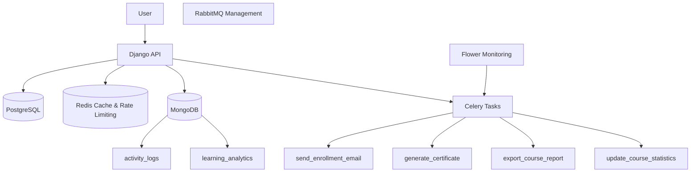
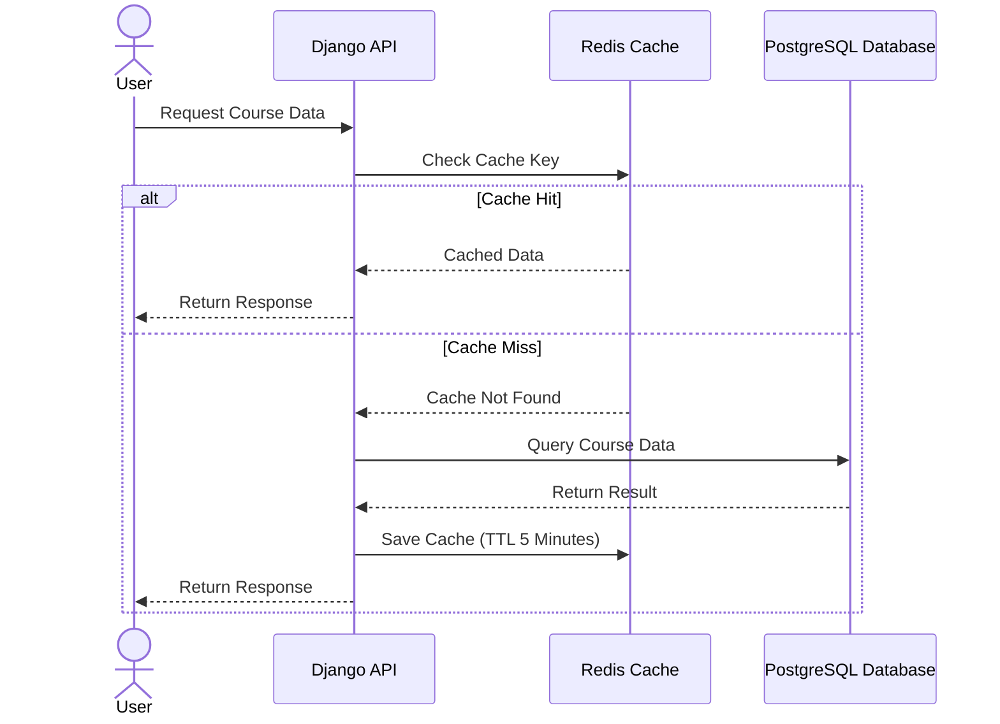
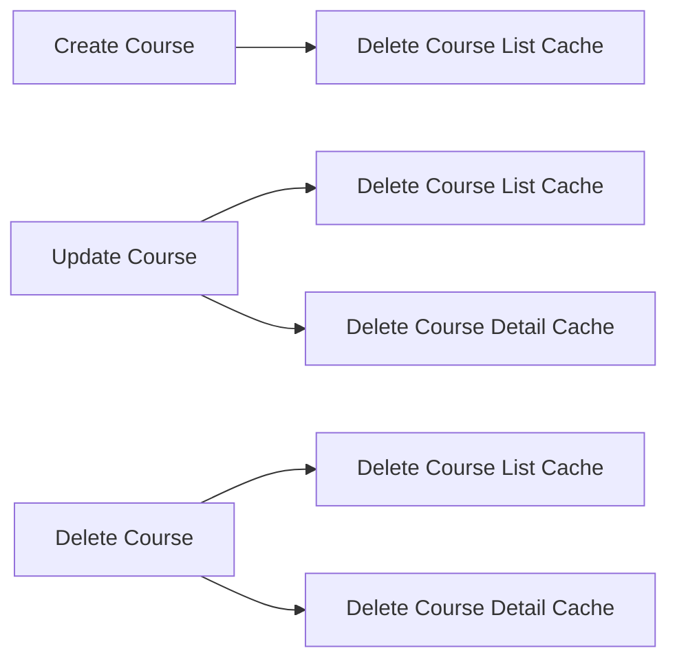
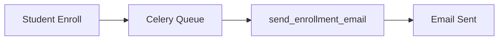
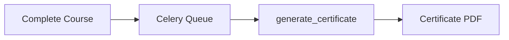
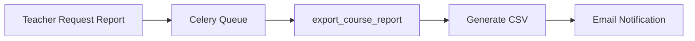
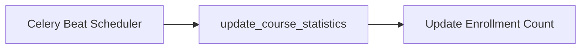

# Architecture Diagram

Diagram arsitektur sistem yang menunjukkan integrasi Django API, PostgreSQL, Redis, MongoDB, Celery, RabbitMQ, dan Flower.

---

# Docker Services

Screenshot berikut menunjukkan seluruh service Docker berhasil berjalan.

**Screenshot:** `docker ps`

Container yang aktif:

* lms-app
* lms-db
* lms-redis
* lms-mongodb
* lms-rabbitmq
* lms-celery-worker
* lms-celery-beat
* lms-flower

---

# API Documentation

Screenshot berikut menunjukkan dokumentasi API berhasil digenerate menggunakan Swagger.

**Screenshot:** `http://localhost:8000/api/docs`

Endpoint yang tersedia:

* Authentication
* Course Management
* Enrollment
* Progress Tracking
* Async Processing

---

# Caching Strategy - Redis

Sistem menggunakan Redis sebagai caching layer untuk meningkatkan performa API dan mengurangi query langsung ke PostgreSQL.

### Endpoint yang Di-cache

| Endpoint                | Key Pattern         | TTL     |
| ----------------------- | ------------------- | ------- |
| GET /api/courses-cached | courses:list:{hash} | 5 menit |
| GET /api/courses/{id}   | course:{id}         | 5 menit |

### Alur Caching

### Cache Invalidation Strategy

---

# Redis Cache

Screenshot berikut menunjukkan key cache berhasil tersimpan di Redis.

**Screenshot:** `redis-cli -> KEYS *`

Key yang berhasil dibuat:

* simple_lms:1:courses:list:...
* simple_lms:1:course:1

---

# Rate Limiting

Screenshot berikut menunjukkan implementasi Redis Rate Limiting.

**Screenshot:** `lms/throttle.py`

Konfigurasi:

* Rate Limit : 60 Request / Minute
* Menggunakan Redis sebagai penyimpanan counter request.

---

# Task Flow Documentation

### Enrollment Email Task

### Certificate Generation Task

### Export Course Report Task

### Update Course Statistics Task

---

# MongoDB Collections

Screenshot berikut menunjukkan collection MongoDB berhasil dibuat.

**Screenshot:** `show collections`

Collection:

* activity_logs
* learning_analytics

---

# Activity Logs

Screenshot berikut menunjukkan aktivitas pengguna berhasil dicatat ke MongoDB.

**Screenshot:** `db.activity_logs.find().limit(5).pretty()`

Aktivitas yang tercatat:

* list_cached
* enroll_async
* complete_course

---

# Learning Analytics

Screenshot berikut menunjukkan data analytics pembelajaran tersimpan di MongoDB.

**Screenshot:** `db.learning_analytics.find().limit(5).pretty()`

Data yang tersimpan:

* user_id
* course_id
* event_type
* timestamp

---

# Aggregation Query

Screenshot berikut menunjukkan query agregasi MongoDB berhasil dijalankan.

**Screenshot:** `db.learning_analytics.aggregate(...)`

Tujuan:

* Menghitung total view per course
* Menentukan course yang paling populer

---

# Flower Monitoring

Screenshot berikut menunjukkan seluruh task Celery berhasil dijalankan.

Task yang berhasil dieksekusi:

* send_enrollment_email
* generate_certificate
* export_course_report
* update_course_statistics

Status: SUCCESS

---

# RabbitMQ Dashboard

Screenshot berikut menunjukkan RabbitMQ Management Dashboard berhasil berjalan.

Fungsi:

* Message Broker
* Queue Management
* Monitoring Queue

---

# Certificate Generation

Screenshot berikut menunjukkan file sertifikat PDF berhasil dibuat.

File:

* certificate_21_1_1781839120.pdf

---

# CSV Report Generation

Screenshot berikut menunjukkan file laporan CSV berhasil dibuat.

File:

* report_course_54_1781840103.csv

---

# Testing Results

| Fitur                  | Status  |
| ---------------------- | ------- |
| Redis Cache            | SUCCESS |
| Rate Limiting          | SUCCESS |
| MongoDB Logging        | SUCCESS |
| Learning Analytics     | SUCCESS |
| Aggregation Query      | SUCCESS |
| Celery Tasks           | SUCCESS |
| RabbitMQ               | SUCCESS |
| Flower Monitoring      | SUCCESS |
| Certificate Generation | SUCCESS |
| CSV Report Export      | SUCCESS |

---

# Conclusion

Seluruh fitur Advanced Features Integration berhasil diimplementasikan dan diuji menggunakan Redis, MongoDB, Celery, RabbitMQ, Flower, PostgreSQL, dan Docker. Seluruh requirement tugas berhasil dipenuhi dan berjalan dengan baik.
