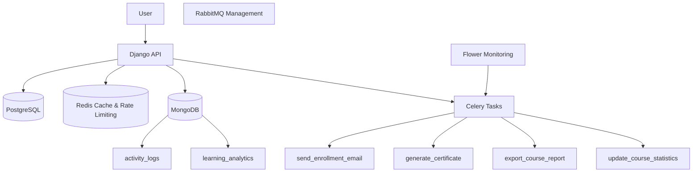

# Testing Results

Architecture Diagram

## Redis Cache

Bukti Course List Cache dan Course Detail Cache.

Terlihat key cache:

- simple_lms:1:courses:list:...
- simple_lms:1:course:1

---

## MongoDB Collections

Bukti collection MongoDB berhasil dibuat.

Collection:

- activity_logs
- learning_analytics

---

## MongoDB Aggregation Query

Bukti aggregation query berhasil dijalankan.

---

## Flower Monitoring

Bukti seluruh Celery Task berhasil dijalankan.

Task:

- send_enrollment_email
- generate_certificate
- export_course_report
- update_course_statistics

Status:

SUCCESS

---

## Certificate Generation

Bukti file PDF berhasil dibuat.

File:

certificate_21_1_1781839120.pdf

---

## CSV Report

Bukti file CSV berhasil dibuat.

---

## RabbitMQ Dashboard

Bukti RabbitMQ berjalan.

---

## Swagger Documentation

Bukti endpoint API tersedia.

