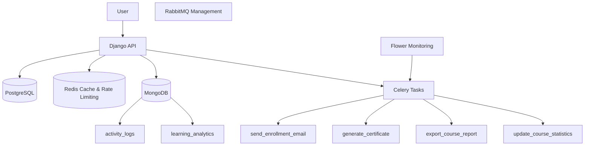
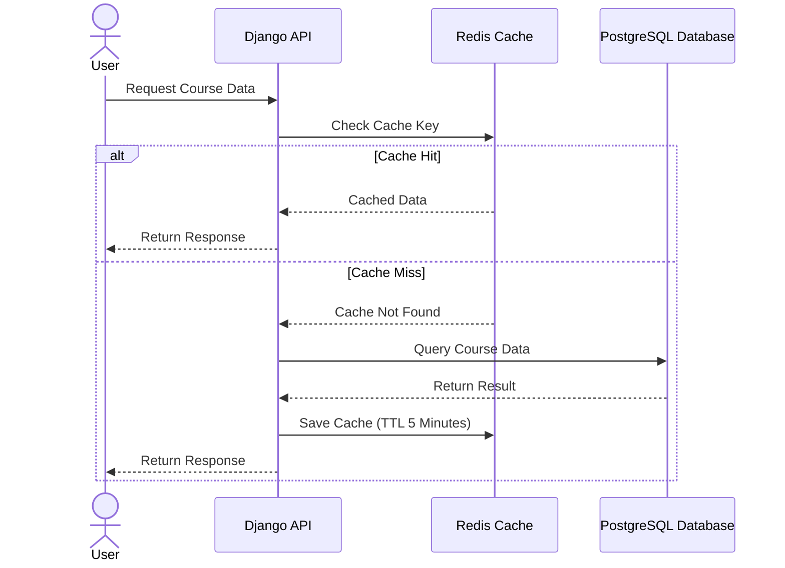
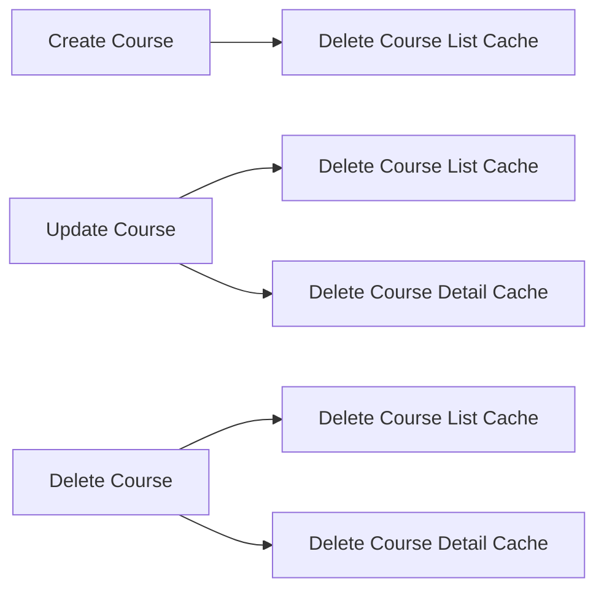
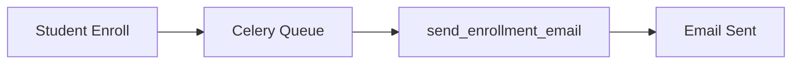
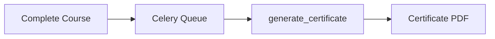
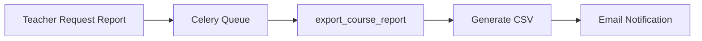
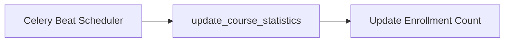

# Testing Results

Architecture Diagram



## Caching Strategy - Redis

Sistem menggunakan Redis sebagai caching layer untuk mengurangi query ke PostgreSQL dan meningkatkan performa API.

### Endpoint yang Di-cache

| Endpoint                  | Key Pattern           | TTL     |
| ------------------------- | --------------------- | ------- |
| `GET /api/courses-cached` | `courses:list:{hash}` | 5 menit |
| `GET /api/courses/{id}`   | `course:{id}`         | 5 menit |

### Alur Caching



### Cache Invalidation Strategy

Cache akan dihapus ketika data course mengalami perubahan.



Implementasi cache invalidation dilakukan menggunakan:

```python
cache.delete_pattern("courses:list:*")
cache.delete(f"course:{id}")
```

## Redis Cache

Bukti Course List Cache dan Course Detail Cache.


Terlihat key cache:

- simple_lms:1:courses:list:...
- simple_lms:1:course:1

---

## Task Flow Documentation

### 1. Enrollment Email Task

Task ini dijalankan ketika mahasiswa berhasil melakukan enrollment course.



---

### 2. Certificate Generation Task

Task ini dijalankan ketika mahasiswa menyelesaikan course.



---

### 3. Export Course Report Task

Task ini digunakan untuk membuat laporan peserta course dalam format CSV.



---

### 4. Update Course Statistics Task

Task ini dijalankan secara berkala menggunakan Celery Beat.



## MongoDB Collections

Bukti collection MongoDB berhasil dibuat.


Collection:

- activity_logs
- learning_analytics

---

## MongoDB Aggregation Query

Bukti aggregation query berhasil dijalankan.


---

## Flower Monitoring

Bukti seluruh Celery Task berhasil dijalankan.


Task:

- send_enrollment_email
- generate_certificate
- export_course_report
- update_course_statistics

Status:

SUCCESS

---

## Certificate Generation

Bukti file PDF berhasil dibuat.


File:

certificate_21_1_1781839120.pdf

---

## CSV Report

Bukti file CSV berhasil dibuat.


---

## RabbitMQ Dashboard

Bukti RabbitMQ berjalan.


---

## Swagger Documentation

Bukti endpoint API tersedia.


