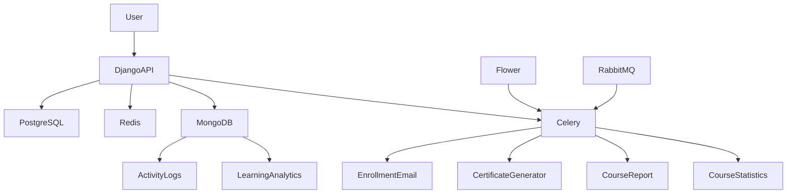

# Simple LMS - Advanced Features Integration

## Overview

Simple LMS - Advanced Features Integration merupakan pengembangan dari sistem Learning Management System (LMS) berbasis Django yang mengintegrasikan berbagai teknologi modern untuk meningkatkan performa, skalabilitas, monitoring, dan analitik sistem.

Proyek ini mengimplementasikan:

* Redis sebagai caching layer dan rate limiting
* MongoDB untuk activity logging dan learning analytics
* Celery untuk asynchronous task processing
* RabbitMQ sebagai message broker service
* Flower untuk monitoring Celery tasks
* PostgreSQL sebagai database utama
* Docker Compose untuk container orchestration

---

# System Architecture



---

# Technology Stack

| Component         | Technology              |
| ----------------- | ----------------------- |
| Backend API       | Django 5 + Django Ninja |
| Database          | PostgreSQL 16           |
| Cache             | Redis 7                 |
| Analytics Storage | MongoDB 6               |
| Async Processing  | Celery 5                |
| Message Broker    | RabbitMQ 3              |
| Monitoring        | Flower                  |
| Containerization  | Docker Compose          |

---

# Docker Services

## Application Service

Service utama yang menjalankan Django API.

Container:

```text
lms-app
```

Port:

```text
8000
```

---

## PostgreSQL

Database utama untuk menyimpan data LMS.

Container:

```text
lms-db
```

Port:

```text
5436 -> 5432
```

---

## Redis

Digunakan untuk:

* Course caching
* Rate limiting
* Celery result backend

Container:

```text
lms-redis
```

Port:

```text
6379
```

---

## MongoDB

Digunakan untuk:

* Activity logging
* Learning analytics

Container:

```text
lms-mongodb
```

Port:

```text
27017
```

---

## RabbitMQ

Message broker service.

Container:

```text
lms-rabbitmq
```

Port:

```text
5672
```

Management Dashboard:

```text
http://localhost:15672
```

---

## Celery Worker

Menjalankan asynchronous tasks.

Container:

```text
lms-celery-worker
```

---

## Celery Beat

Menjalankan scheduled tasks.

Container:

```text
lms-celery-beat
```

---

## Flower

Monitoring Celery secara realtime.

Container:

```text
lms-flower
```

URL:

```text
http://localhost:5555
```

---

# Redis Integration

## Course List Caching

Endpoint:

```http
GET /api/courses-cached
```

Cache Key:

```text
simple_lms:1:courses:list:*
```

Tujuan:

* Mengurangi query ke PostgreSQL
* Mempercepat response API

---

## Course Detail Caching

Endpoint:

```http
GET /api/courses/{id}
```

Cache Key:

```text
simple_lms:1:course:{id}
```

Contoh:

```text
simple_lms:1:course:1
```

---

## Cache Invalidation Strategy

Cache akan dihapus saat:

* Create Course
* Update Course
* Delete Course

Implementasi:

```python
cache.delete_pattern("courses:list:*")
cache.delete(f"course:{id}")
```

---

# Rate Limiting

Sistem menggunakan Redis untuk membatasi jumlah request.

Konfigurasi:

```python
class RedisRateThrottle(BaseThrottle):
    def __init__(self, rate="60/minute"):
```

Batas:

```text
60 Requests / Minute
```

Tujuan:

* Mencegah abuse API
* Menjaga stabilitas server

---

# MongoDB Integration

## Activity Log Collection

Collection:

```text
activity_logs
```

Digunakan untuk menyimpan aktivitas pengguna.

Contoh data:

```json
{
  "user_id": 21,
  "action": "enroll_async",
  "resource_type": "course",
  "resource_id": 1
}
```

Aktivitas yang dicatat:

* list_cached
* enroll_async
* complete_course
* export_report

---

## Learning Analytics Collection

Collection:

```text
learning_analytics
```

Digunakan untuk menyimpan aktivitas pembelajaran.

Contoh:

```json
{
  "user_id": 21,
  "course_id": 1,
  "event_type": "view"
}
```

---

## Aggregation Query

MongoDB digunakan untuk melakukan analisis data.

Contoh query:

```javascript
db.learning_analytics.aggregate([
{
    $group: {
        _id: "$course_id",
        total_views: { $sum: 1 }
    }
}
])
```

Output:

```json
[
{
    "_id": 1,
    "total_views": 1
}
]
```

Tujuan:

* Menentukan course paling populer
* Menampilkan statistik pembelajaran

---

# Celery Tasks

## 1. send_enrollment_email

Fungsi:

Mengirim email ketika mahasiswa berhasil melakukan enrollment.

Flow:

```text
Student Enroll
      ↓
Celery Queue
      ↓
send_enrollment_email
      ↓
Email Sent
```

---

## 2. generate_certificate

Fungsi:

Membuat sertifikat PDF ketika mahasiswa menyelesaikan course.

Output:

```text
media/certificates/
```

Contoh:

```text
certificate_21_1_1781839120.pdf
```

Flow:

```text
Complete Course
      ↓
Celery Queue
      ↓
generate_certificate
      ↓
PDF Certificate
```

---

## 3. export_course_report

Fungsi:

Membuat laporan CSV peserta course secara asynchronous.

Output:

```text
media/reports/
```

Contoh:

```text
report_course_54_1781840103.csv
```

Isi CSV:

```csv
No,Username,Email,Role,Date Joined
1,mhs021,...
2,mhs033,...
```

Flow:

```text
Teacher Request Report
        ↓
Celery Queue
        ↓
export_course_report
        ↓
CSV Generated
        ↓
Email Notification
```

---

## 4. update_course_statistics

Fungsi:

Mengupdate statistik enrollment course.

Jadwal:

```text
Setiap 1 Jam
```

Dijalankan oleh:

```text
Celery Beat
```

---

# Flower Monitoring

Flower digunakan untuk memonitor task Celery secara realtime.

URL:

```text
http://localhost:5555
```

Task yang berhasil diuji:

* send_enrollment_email
* generate_certificate
* export_course_report
* update_course_statistics

Status:

```text
SUCCESS
```

---

# RabbitMQ

RabbitMQ digunakan sebagai message broker service pada arsitektur sistem.

Management Dashboard:

```text
http://localhost:15672
```

Credential:

```text
Username : rabbitmq
Password : 1234
```

Fungsi:

* Message queue management
* Broker communication
* Queue monitoring

---

# Redis CLI Documentation

Masuk ke Redis:

```bash
docker exec -it lms-redis redis-cli -a 1234
```

Pilih Database:

```redis
SELECT 1
```

Melihat Cache:

```redis
KEYS *
```

Contoh:

```text
simple_lms:1:courses:list:d41d8cd98f00...
simple_lms:1:course:1
```

Menghapus Cache:

```redis
DEL key_name
```

---

# API Documentation

Swagger Documentation:

```text
http://localhost:8000/api/docs
```

Fitur API:

* Authentication
* Course Management
* Enrollment
* Progress Tracking
* Redis Cache Endpoint
* Async Processing Endpoint

---

# Testing Results

## Redis Cache

Berhasil menyimpan:

```text
simple_lms:1:courses:list:*
simple_lms:1:course:1
```

Status:

```text
SUCCESS
```

---

## MongoDB

Collection berhasil dibuat:

```text
activity_logs
learning_analytics
```

Status:

```text
SUCCESS
```

---

## Certificate Generation

File PDF berhasil dibuat:

```text
certificate_21_1_1781839120.pdf
```

Status:

```text
SUCCESS
```

---

## CSV Report Export

File CSV berhasil dibuat:

```text
report_course_54_1781840103.csv
```

Status:

```text
SUCCESS
```

---

## Flower Monitoring

Semua task berhasil dieksekusi:

```text
send_enrollment_email      SUCCESS
generate_certificate      SUCCESS
export_course_report      SUCCESS
update_course_statistics  SUCCESS
```

---

# Conclusion

Implementasi Advanced Features pada Simple LMS berhasil dilakukan dengan mengintegrasikan Redis, MongoDB, Celery, RabbitMQ, Flower, dan PostgreSQL dalam satu arsitektur berbasis Docker.

Fitur yang berhasil diimplementasikan meliputi:

* Redis caching untuk optimasi performa
* Redis rate limiting 60 request per menit
* MongoDB activity logging
* MongoDB learning analytics
* Aggregation query untuk laporan analytics
* Celery asynchronous task processing
* Certificate generation PDF
* CSV report generation
* Flower monitoring
* Docker-based deployment

Seluruh deliverable yang diminta pada tugas telah berhasil diimplementasikan dan diuji dengan hasil yang sesuai.
