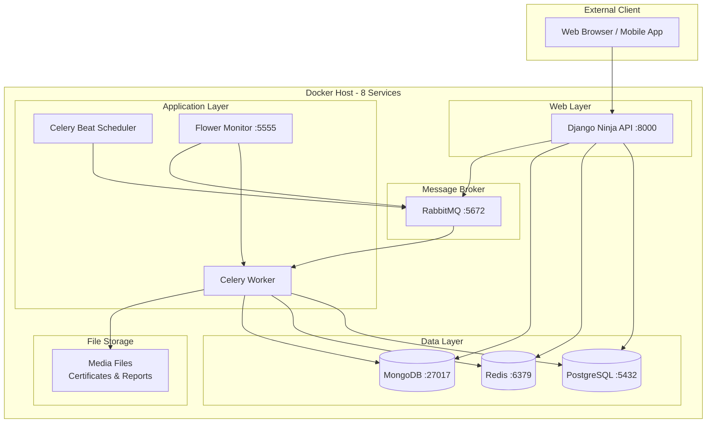

# Architecture Diagram - Simple LMS Advanced Features

## Gambaran Umum Arsitektur

Simple LMS menggunakan arsitektur microservices berbasis Docker yang terdiri dari 8 container:

- Django Ninja API (REST API)
- PostgreSQL (database relasional)
- Redis (cache & message broker)
- MongoDB (document store untuk log)
- RabbitMQ (message queue)
- Celery Worker (async task executor)
- Celery Beat (scheduled task)
- Flower (task monitoring)

## Diagram Arsitektur

