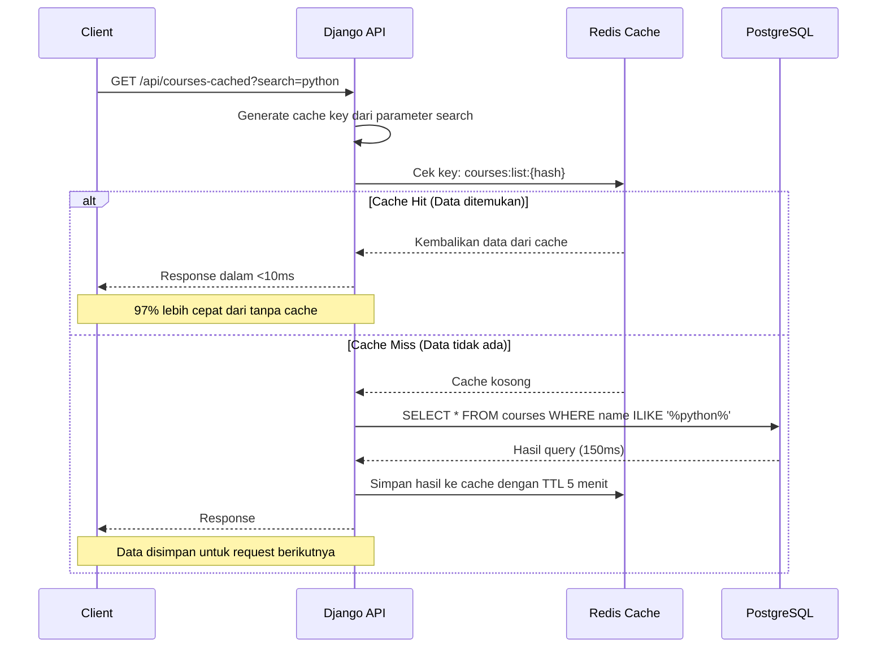

# Caching Strategy - Redis

## Endpoint yang Di-cache

| Endpoint                  | Key Pattern           | TTL     |
| ------------------------- | --------------------- | ------- |
| `GET /api/courses-cached` | `courses:list:{hash}` | 5 menit |

## Alur Caching

