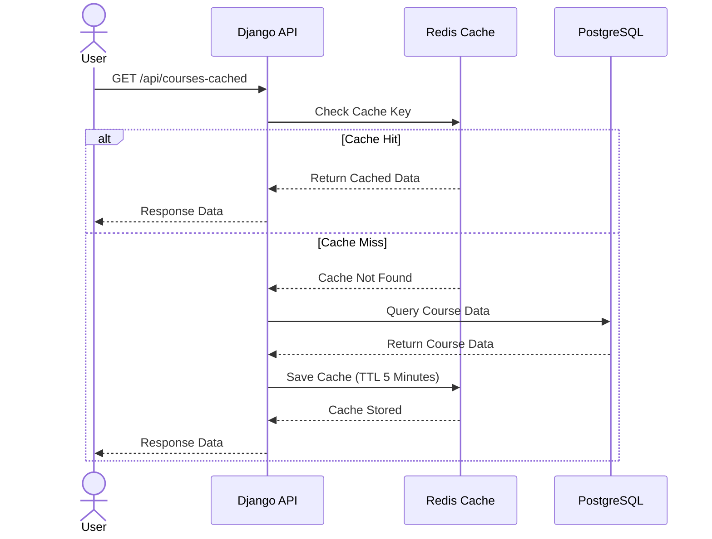

```mermaid
sequenceDiagram

    actor User

    participant API as Django API
    participant Redis as Redis Cache
    participant DB as PostgreSQL

    User->>API: GET /api/courses-cached

    API->>Redis: Check Cache Key

    alt Cache Hit

        Redis-->>API: Return Cached Data

        API-->>User: Response Data

    else Cache Miss

        Redis-->>API: Cache Not Found

        API->>DB: Query Course Data

        DB-->>API: Return Course Data

        API->>Redis: Save Cache (TTL 5 Minutes)

        Redis-->>API: Cache Stored

        API-->>User: Response Data

    end
```
