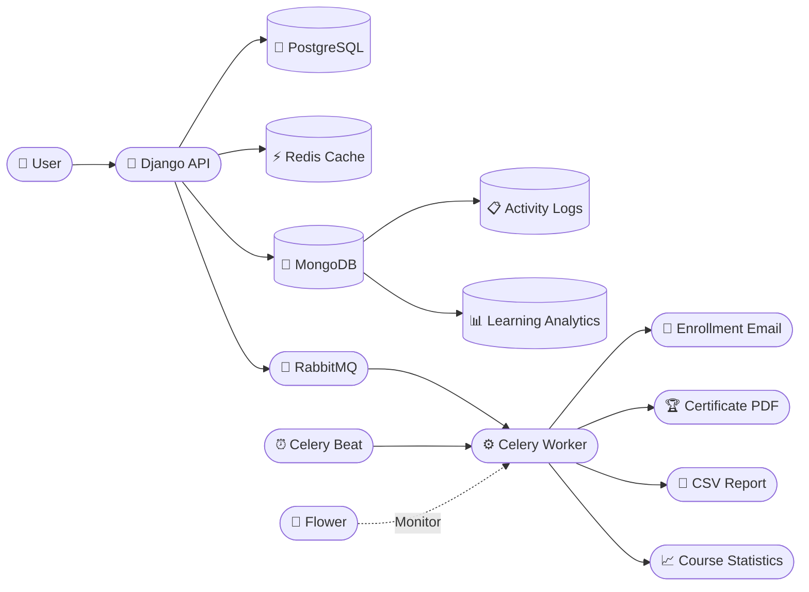

```mermaid
flowchart LR

    USER([👤 User])

    API([🚀 Django API])

    PG[(🐘 PostgreSQL)]
    REDIS[(⚡ Redis Cache)]
    MONGO[(🍃 MongoDB)]

    ACT[(📋 Activity Logs)]
    ANALYTICS[(📊 Learning Analytics)]

    RABBIT([🐰 RabbitMQ])

    WORKER([⚙️ Celery Worker])
    BEAT([⏰ Celery Beat])
    FLOWER([🌸 Flower])

    EMAIL([📧 Enrollment Email])
    CERT([🏆 Certificate PDF])
    REPORT([📄 CSV Report])
    STATS([📈 Course Statistics])

    USER --> API

    API --> PG
    API --> REDIS
    API --> MONGO

    MONGO --> ACT
    MONGO --> ANALYTICS

    API --> RABBIT

    RABBIT --> WORKER

    BEAT --> WORKER

    FLOWER -. Monitor .-> WORKER

    WORKER --> EMAIL
    WORKER --> CERT
    WORKER --> REPORT
    WORKER --> STATS
```
