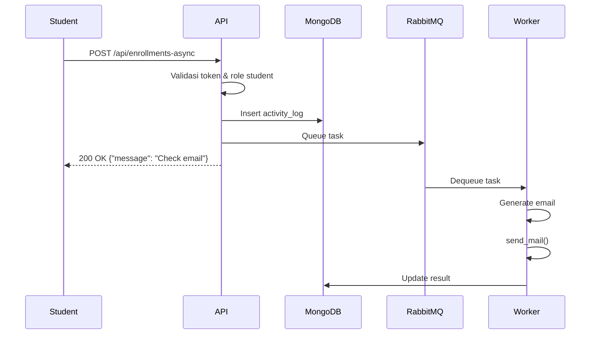

# Task Flow - Celery

## 4 Celery Tasks

| Task                       | Trigger                                 | Output                       |
| -------------------------- | --------------------------------------- | ---------------------------- |
| `send_enrollment_email`    | `POST /api/enrollments-async`           | Email ke console             |
| `generate_certificate`     | `POST /api/courses/{id}/complete-async` | PDF di `media/certificates/` |
| `export_course_report`     | `POST /api/courses/{id}/export-async`   | CSV di `media/reports/`      |
| `update_course_statistics` | Celery Beat (tiap jam)                  | Log statistik                |

---

## Task 1: send_enrollment_email

**Trigger:** `POST /api/enrollments-async`

